# Configurando o navigation e o stack navigation:
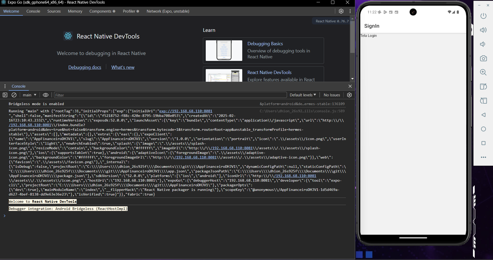

# Criando a tela de login:
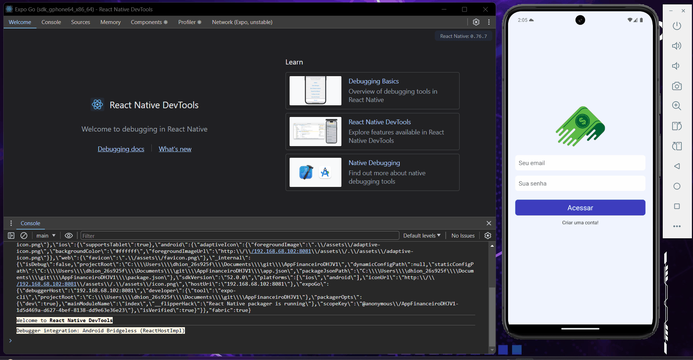

# Tela de Criação SigUp
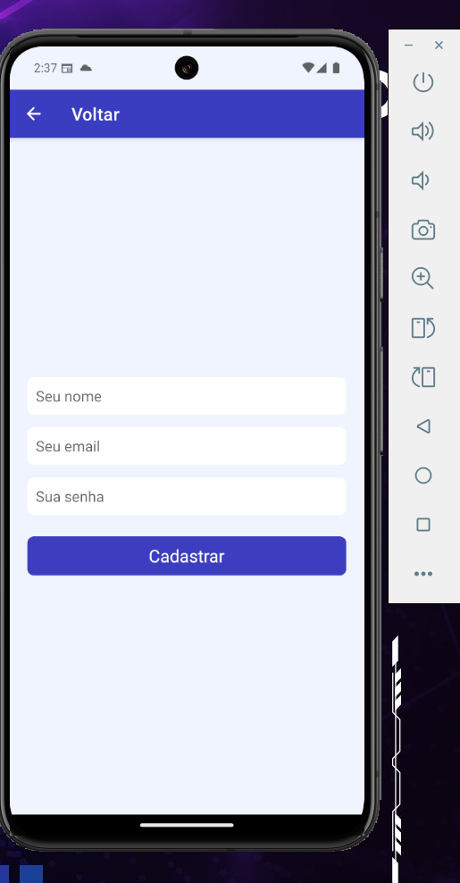

# Criando o backend e a API:
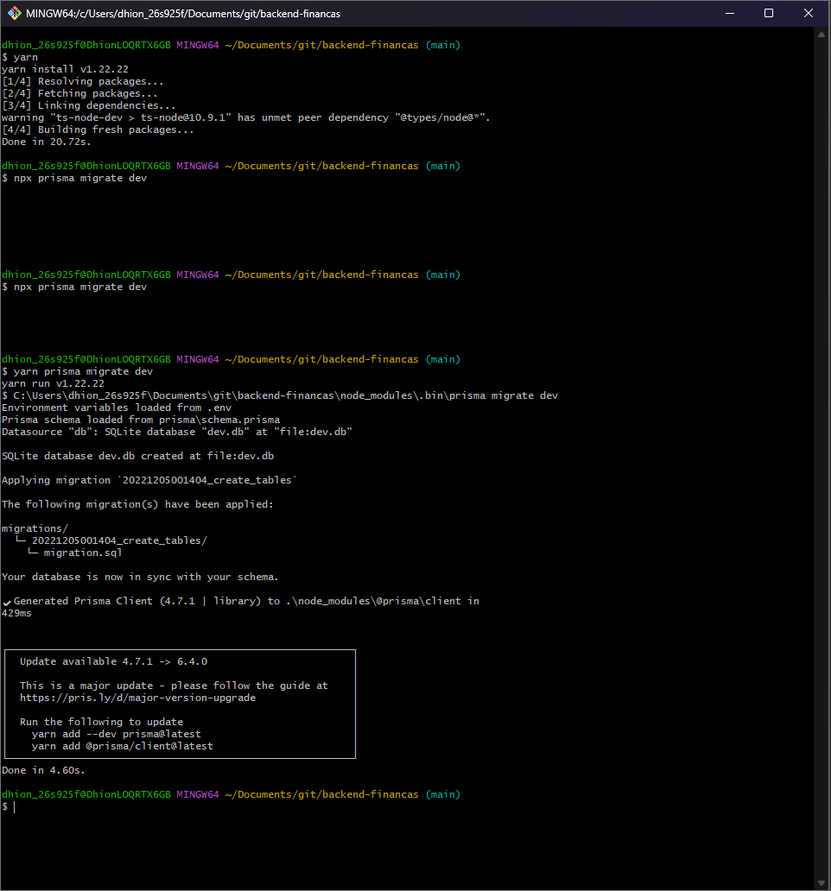

# Logout
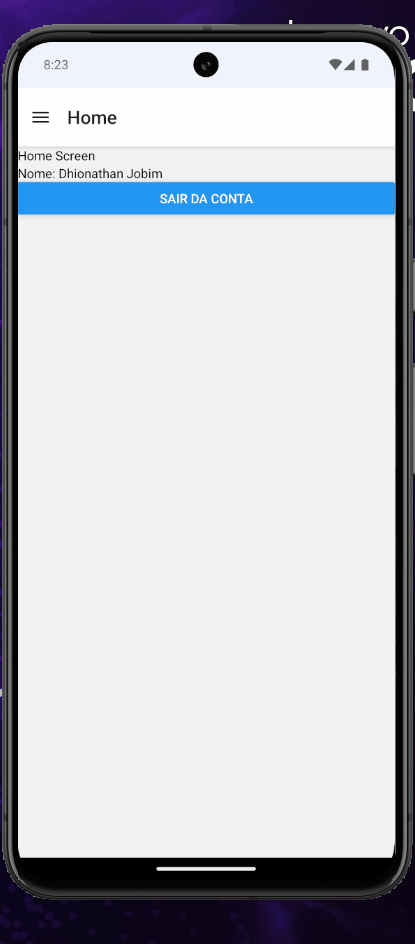

# Criando o header e aplicando um botão menu de navegação
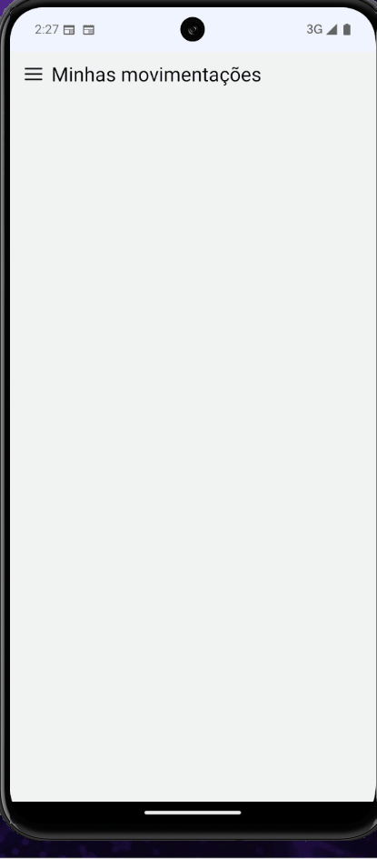

# Cards de movimentação:
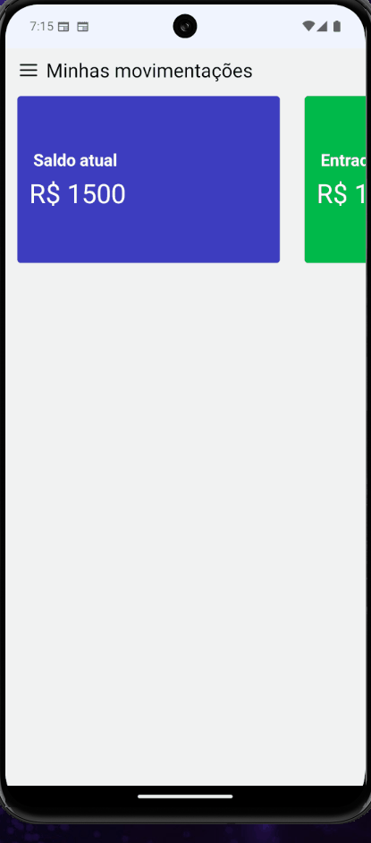
# Tela New
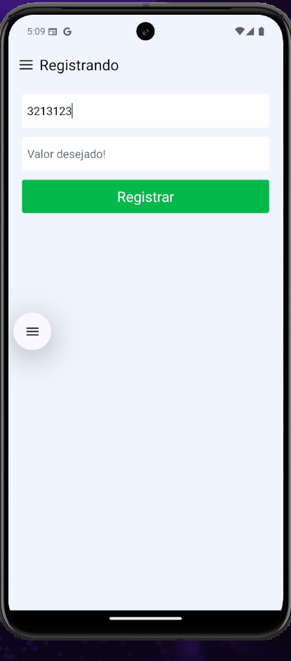

# Criando botões de seleção
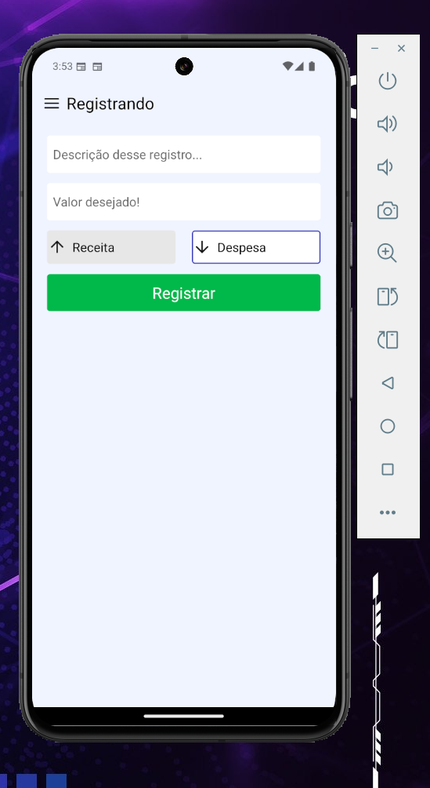

# Adicionando novas receitas e despesas
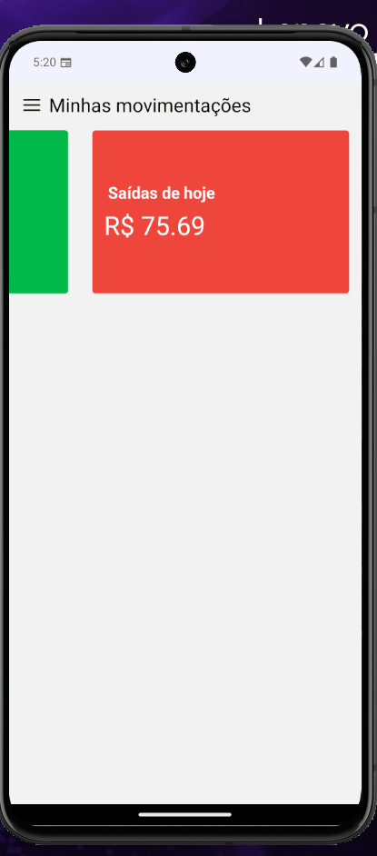

# Listagem de receitas e despesas
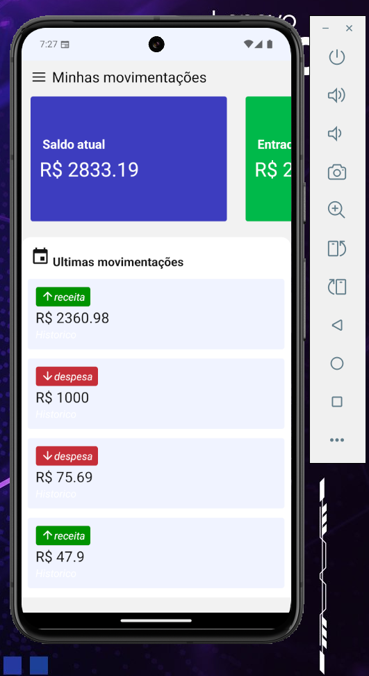

# Deletando gastos ou ganhos registrados:
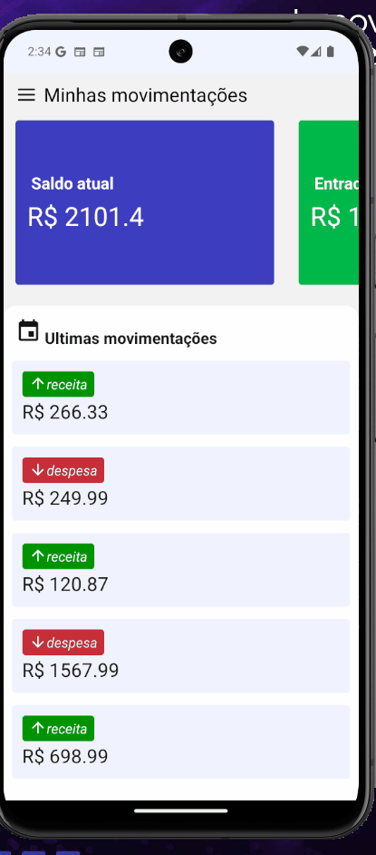

# Tela perfil 
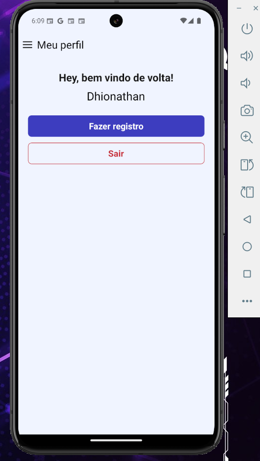

# Indo para criação de registros e fazendo logout pelo perfil
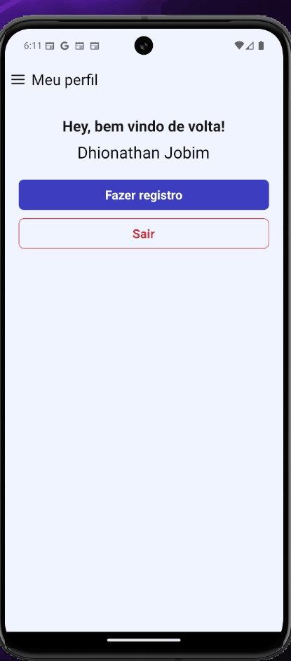

# Drawner personalizado
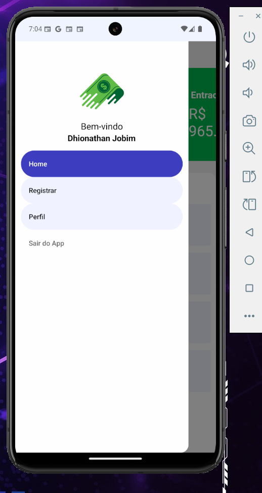